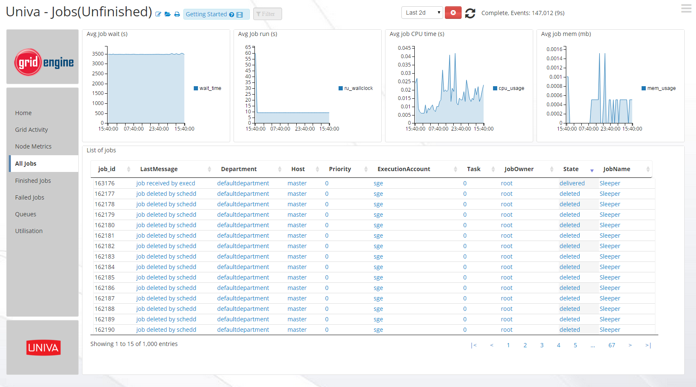
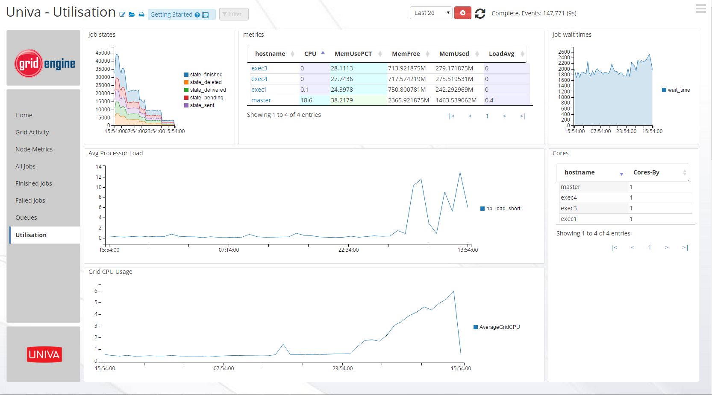

#########################################################################
# Univa Grid Engine App
# For additional inquiries please contact support@logscape.com
# Download it [Here](https://github.com/logscape/UGEApp/blob/master/Dist/UGEApp-1.0.zip?raw=true)
# And the Override properties [Here](https://github.com/logscape/UGEApp/raw/master/Dist/UGEApp-1.0-override.properties)
#########################################################################

# Introduction
Univa Grid Engine App 1.0 is designed to provide monitoring for Grid Installations version 8.2.1 (or greater)

The App makes use of a properly configured reporting file in order to determine statistics about your grid, your reporting file can be found in $UNIVA_HOME/$UNIVA_CELL/common/reporting

This app runs a groovy script that will monitor the reporting file, and breaking it into four seperate metric specific files

- stats.log
- jobs.log
- new_job.log
- acct.log

# Overview 
-----------------------------------------------------------------------
A path must be specified in the UGEApp-1.0-override.properties file in order for the app to run, this path variable is used by the logTailer to locate your reporting file.

Because all execution hosts transfer their log data to the qmaster, only the master requires a logscape forwarder in order for the Univa App to be functional, you may however want to install forwarders on execution daemons for useful tools such as the Univa App.

Due to the apps nature, in that it simply tails the Univa reporting file, the user must have their own solution in place for rolling, or deleting the reporting file if disk space is a premium. This also means metrics will not be collected from the master for periods 

-----------------------------------------------------------------------

# CONFIGURATION

This configuration guide presumes you have already followed the Univa provided documentation to enable reporting and set your polling interval to the desired level of granularity.

1. Edit the reporting variables on each of your UGE Hosts to the following.
    * reporting_variables mem_free,mem_used,load_avg,cpu,np_load_short,m_core
    
2. Edit the following file: UGEApp-1.0-override.properties
	You need to provide the full of relative path to your reporting file as well as change the resourceSelection to be appropriate for your environments qmaster hostname.

------------------------------------------------------------------------

# OUTPUT

This app breaks up the main Univa reporting file into its component parts, here is a run down of what is in each file.

- stats.log - Stats on overall node health, including metrics such as core count, cpu and memory utilisation as well as average load. 
- jobs.log - Stats on completed jobs, offers a more in-depth look at a job than the new_job log allowing you see wait time, processing time, amount of memory used during the task and other useful metrics.
- new_job.log - Log based upon stats given by a job when it is first created, used to display which users are putting work into the grid, and the works intended location.
- acct.log - Shows metrics such as the exact user, time and command used to submit a job. 

# Screenshots 

 

 ------------------------------------------------------------------------

 

 ------------------------------------------------------------------------

 

 ------------------------------------------------------------------------

 

 ------------------------------------------------------------------------

 

 ------------------------------------------------------------------------

 

